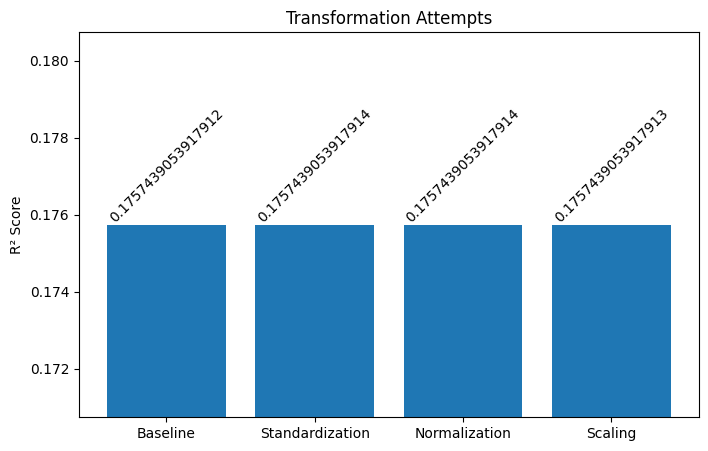
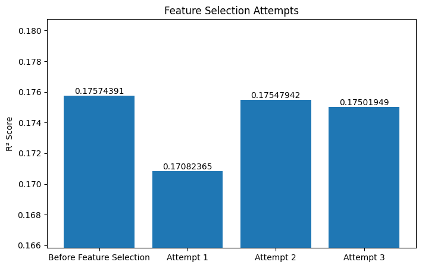
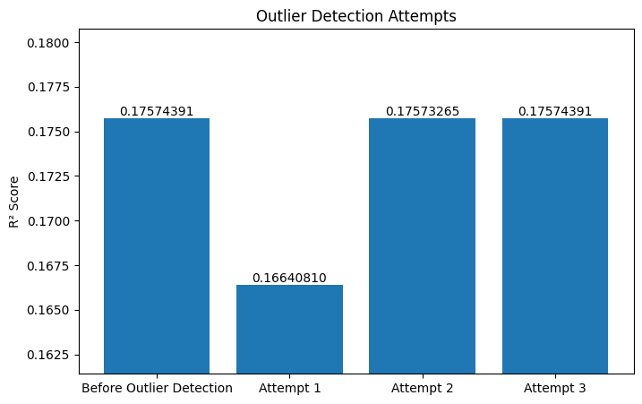

# Project Overview
This project was completed as part of the COMP3400 (Data Preparation Techniques) course. It focuses on building a linear regression model to predict precipitation in the city of London using the london_weather.csv dataset.

# Tech Stack
- Numpy
- Pandas
- Scikit-learn
- Matplotlib
- Jupyter

# Methodology

### **Handling Missing Values**
Before starting building the baseline model, some work was done on the dataset to deal with the missing values found. 

Median imputation was applied to the global_radiation and cloud_cover columns. The median was chosen because it provides a reasonable central value and is less sensitive to extreme observations than the mean. 

### **Baseline Model**
A baseline linear regression model was built to predict precipitation using the london_weather.csv dataset without any further data processing. The predictor variables included all columns except date and precipitation, while precipitation was used as the target variable. 
 
To evaluate the model, I split the dataset into training and test sets using an 80/20 split. I then trained the linear regression model on the training data and measured its predictive performance on the test data using the R² score. 
 
This baseline model obtained an R² score of **0.1757439053917912**.

### **Transformations**
After building the baseline model, I tested different transformation methods to see whether rescaling the predictor variables would improve predictive performance. The three methods I considered were standardization, normalization, and scaling. 
 
For each transformation, I calculated the required transformation values using only the training predictors. I then applied the same transformation to both the training and test predictors, while leaving the target variable unchanged. After that, I trained a new linear regression model and evaluated it using the same test set.
 
The results showed that standardization and normalization gave the best performance, and both produced the same R² score of **0.1757439053917914**. Since their results were equal, I continued with standardization for the next stage of the project.

### **Feature Selection**
After the transformation stage, I moved on to feature selection using the standardized dataset. To do this, I computed the Pearson correlation matrix of the predictor variables and looked for pairs of variables with high correlation. Since highly correlated predictors can reduce the predictive performance of linear regression, I created a table showing, for each variable, how many other variables had a correlation greater than 0.80 with it. I then used this table to decide which variables to test removing.

However, the feature selection attempts did not improve the model’s predictive performance. Since dropping variables such as global_radiation and sunshine decreased the R² score, I decided not to remove any predictor variables and continued with the standardized dataset.

### **Outlier Detection**
After completing the previous stages, I tested several outlier detection settings using column-wise Z-scores. I tried different combinations of threshold values and values of m,where m represents the minimum number of variables in which a row must be an outlier before being removed. 

However, none of the outlier detection attempts improved the model’s predictive performance. Therefore, I decided not to keep any outlier detection operation in the final step.

# Conclusion
The best improvement to the model came from using standardization. Feature selection and outlier detection did not improve the predictive performance, so no variables or observations were removed. Therefore, the final model was the standardized model, which produced the highest R² score of 0.1757439053917914. 